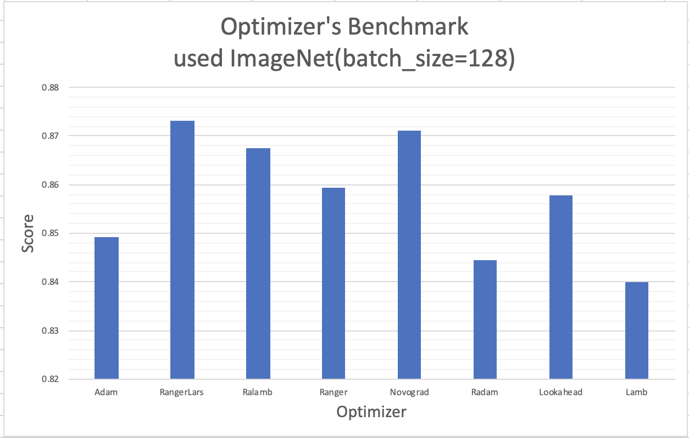
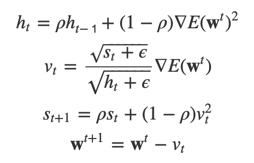
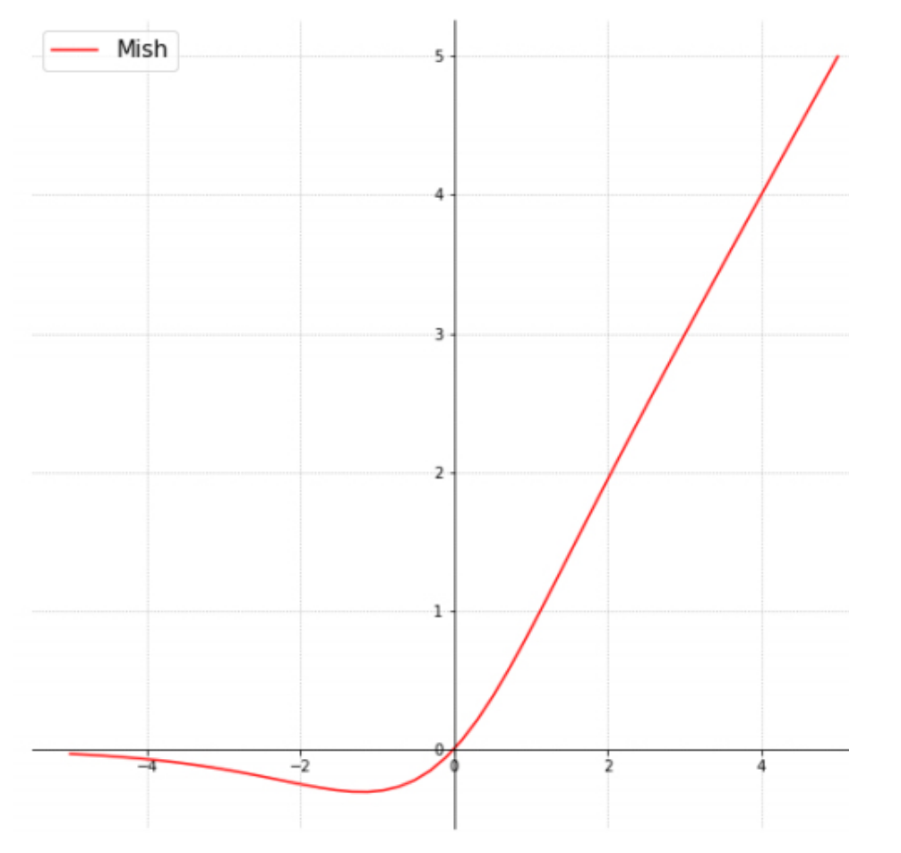
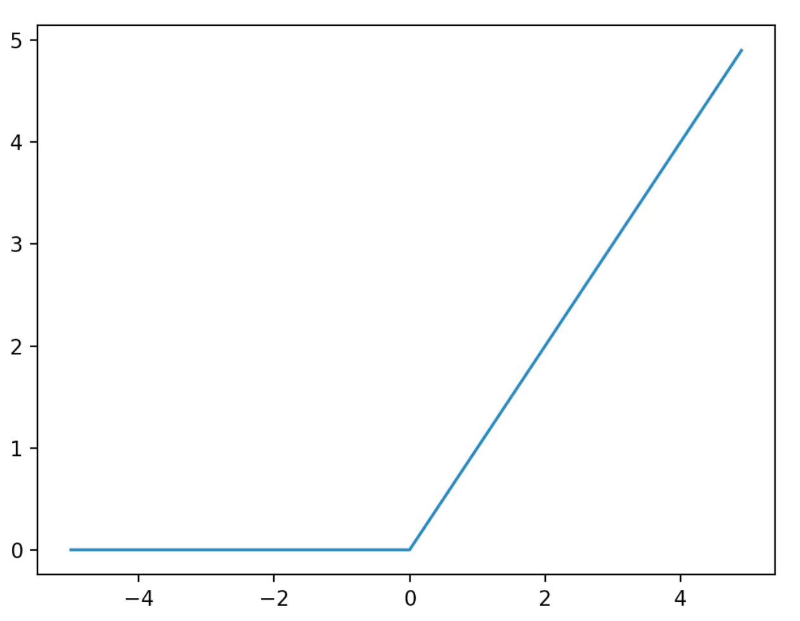
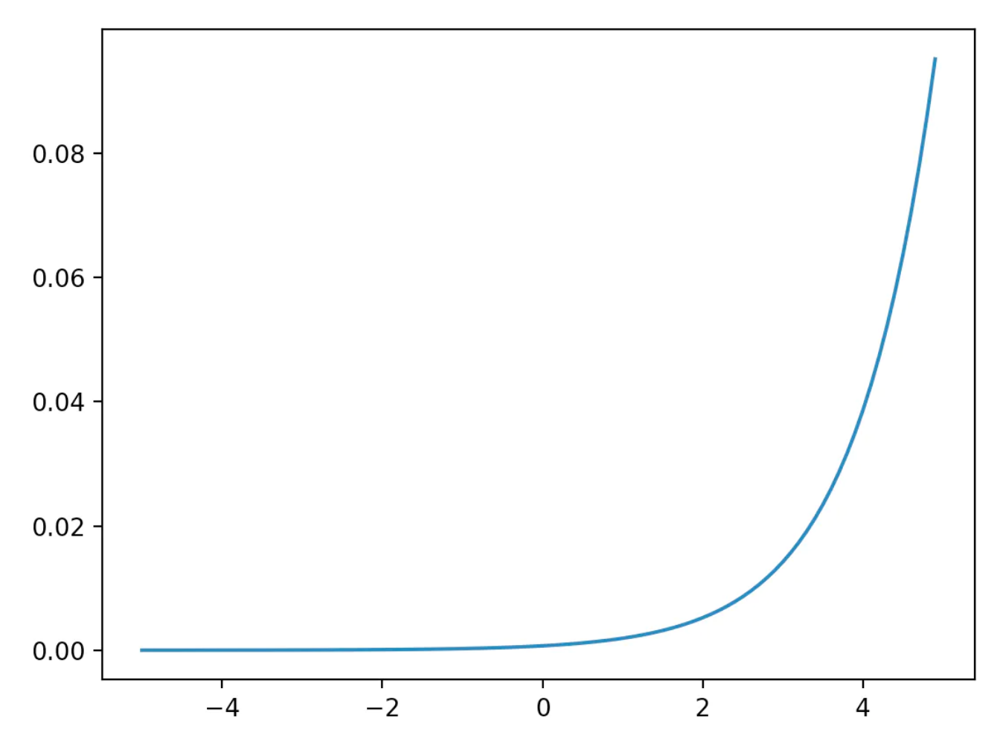

# Tensorflow2.0用のGANライブラリ
# 顔交換アプリはウイルス的？
# Microsoft製　AI麻雀プレイヤー
# 驚愕 ランダムアーキテクチャサーチがニューラルアーキテクチャサーチを破った
# Google MLIRチームのprimer Yann Lecun氏のポッドキャスト
# [最近のoptimizerのベンチマーク](https://github.com/mgrankin/over9000)
 

Every result is avg of 20 runs.

Dataset                               | LR Schedule| Imagenette size 128, 5 epoch | Imagewoof size 128, 5 epoch
---                                   | -- | ---                          | ---
Adam - baseline                |OneCycle| 0.8493                       | 0.6125
RangerLars (RAdam + LARS + Lookahead) |Flat and anneal| 0.8732                       | 0.6523
Ralamb (RAdam + LARS)                 |Flat and anneal| 0.8675                       | 0.6367
Ranger (RAdam + Lookahead)            |Flat and anneal| 0.8594                       | 0.5946
Novograd                              |Flat and anneal| 0.8711                       | 0.6126
Radam                                 |Flat and anneal| 0.8444                       | 0.537
Lookahead                             |OneCycle| 0.8578                       | 0.6106
Lamb                                  |OneCycle| 0.8400                       | 0.5597

reference: https://github.com/mgrankin/over9000

## そもそもOptimizerとはなんぞや
### Adam


* 直近の勾配情報を優先して計算することを狙ったアルゴリズム  
* 初期学習係数を決める必要がない
* εを小さくするほど収束するのに時間がかかる


調べてたらReLUに勝てる?らしい活性化関数、[Mish](https://forums.fast.ai/t/meet-mish-new-activation-function-possible-successor-to-relu/53299)という関数を見つけました。 

## Mish他活性化関数(Acctivation function)
reference : https://forums.fast.ai/t/meet-mish-new-activation-function-possible-successor-to-relu/53299
### ReLU
入力した値が0以下のとき0になり、1より大きいとき入力をそのまま出力する関数


### softmax
分類ならば最後にこれをかけよう！らしい


その他活性化関数についてもこの[Qiita記事](https://qiita.com/namitop/items/d3d5091c7d0ab669195f)がとてもわかりやすくまとまっています
# Tensorflowのための構造化学習フレームワーク
# 少ない枚数の顔交換GAN

---

# [TF-GAN](https://medium.com/tensorflow/introducing-tf-gan-a-lightweight-gan-library-for-tensorflow-2-0-36d767e1abae)
Tensorflowチームが、Tensorflow2.0でのGANの学習のためのコードをいくつかリリースした  
* クラウド上でTPU計算をサポート
* GANを学べるコースを公開  
https://developers.google.com/machine-learning/gan/
* GANの指標
論文間での結果の比較を促進するために、TF-GANにおいて標準指標の使用をさらに簡単にした。
* TF-GANがpip installできるようになった

```
pip install tenforflow-gan
```

* 現在Tensorflow2.0にて動作するが、Kerasでも対応しようとしている（tf.kerasのこと？）

# Introducing Neural Structure Learning in Tensorflow
構造化データをトレーニングに組み込むための新しいTensorFlowフレームワーク

# 便利なディープフェイクアプリがプライバシーの反発を買うレベルまできた
新しいディープフェイク顔交換アプリであるZaoが、中国のアプリストアでヒット